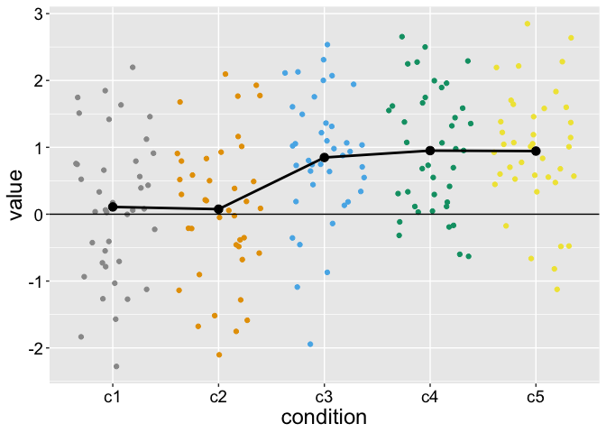
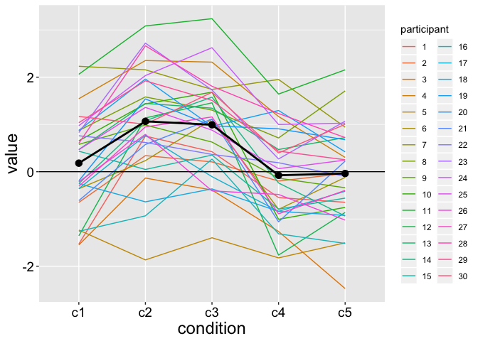
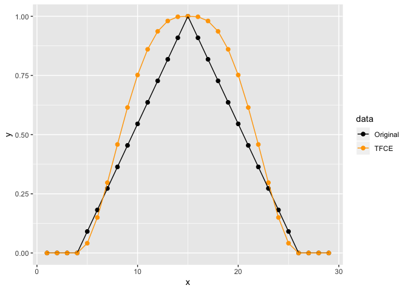

<!-- README.md is generated from README.Rmd. Please edit that file -->
ccmc
====

Cluster Correction for Multiple Comparisons (v. 0.0.0.9000)

The goal of ccmc is to correct for multiple comparisons of dependent tests using cluster-based statistics. The rationale for this approach is described [here](https://garstats.wordpress.com/2018/09/06/cluster/).

Installation
------------

The package can be installed using these commands:

``` r
install.packages("devtools")
devtools::install_github("GRousselet/ccmc")
```

Examples
--------

### No effect: 5 independent groups

``` r
set.seed(21)
N <- 40 # observations per group
Ng <- 5 # number of groups
x <- matrix(rnorm(N*Ng), ncol = Ng)
trimbt.ccmc(x,nullval=0,tr=0,alpha=.05,bt=FALSE,nboot=599)
#> $estimate
#> [1]  0.10874394  0.07522792 -0.15204819 -0.04906556 -0.05576724
#> 
#> $ci
#>            [,1]      [,2]
#> [1,] -0.2350301 0.4525180
#> [2,] -0.2656745 0.4161304
#> [3,] -0.4575898 0.1534934
#> [4,] -0.3404193 0.2422882
#> [5,] -0.3455473 0.2340128
#> 
#> $tval
#> [1]  0.6398254  0.4463530 -1.0065618 -0.3406321 -0.3892604
#> 
#> $pval
#> [1] 0.5260272 0.6578109 0.3203500 0.7352087 0.6992010
#> 
#> $cluster.th
#> [1] 7.670319
#> 
#> $cluster.map
#> [1] 0 0 0 0 0
#> 
#> $cluster.sig
#> [1] FALSE
```

### Cluster of length 3 with 5 independent groups

Make data

``` r
set.seed(21)
N <- 40 # observations per group
Ng <- 5 # number of groups
x <- matrix(rnorm(N*Ng), ncol = Ng)
x[,3:5] <- x[,3:5] + 1
```

Illustrate data

``` r
cbPalette <- c("#999999", "#E69F00", "#56B4E9", "#009E73", "#F0E442", "#0072B2", "#D55E00", "#CC79A7")

# data frame of independent observations
df <- as.tibble(x)
colnames(df) <- c("c1", "c2", "c3", "c4", "c5")
df <- gather(df, condition, value)
df$condition <- factor(df$condition)

# data frame of means
tmp <- as_tibble(x)
colnames(tmp) <- c("c1", "c2", "c3", "c4", "c5")
df.mean <- tidyr::gather(dplyr::summarise_all(tmp, funs(mean)),condition, value)
df.mean$condition <- as.factor(df.mean$condition)

ggplot(df, aes(x=condition, y=value, colour=condition)) + theme_grey() + 
  geom_jitter() +
  scale_colour_manual(values=cbPalette) +
  geom_line(data = df.mean, aes(group = 1), colour = "black", size = 1) +
  geom_point(data = df.mean, colour = "black", size = 3) +
  geom_abline(slope = 0, intercept = 0) + 
  theme(axis.title = element_text(size = 18),
        axis.text = element_text(size = 14, colour="black"),
        legend.position="none")
```



Mass cluster test

``` r
trimbt.ccmc(x,nullval=0,tr=0,alpha=.05,bt=FALSE,nboot=599)
#> $estimate
#> [1] 0.10874394 0.07522792 0.84795181 0.95093444 0.94423276
#> 
#> $ci
#>            [,1]      [,2]
#> [1,] -0.2350301 0.4525180
#> [2,] -0.2656745 0.4161304
#> [3,]  0.5424102 1.1534934
#> [4,]  0.6595807 1.2422882
#> [5,]  0.6544527 1.2340128
#> 
#> $tval
#> [1] 0.6398254 0.4463530 5.6134568 6.6017555 6.5908298
#> 
#> $pval
#> [1] 5.260272e-01 6.578109e-01 1.782390e-06 7.581450e-08 7.849784e-08
#> 
#> $cluster.th
#> [1] 7.55154
#> 
#> $cluster.map
#> [1] 0 0 1 1 1
#> 
#> $cluster.sig
#> [1] FALSE FALSE  TRUE  TRUE  TRUE
```

Use bootstrap-t thresholds

``` r
trimbt.ccmc(x,nullval=0,tr=0,alpha=.05,bt=TRUE,nboot=599)
```

Get cluster statistics for cluster 1:

``` r
out <- trimbt.ccmc(x,nullval=0,tr=0,alpha=.05,bt=TRUE,nboot=599)
c2sum <- sum(out$tval[out$cluster.map==1]^2)
```

### Cluster of length 2: 5 dependent groups

Make data

``` r
require(MASS)
#> Loading required package: MASS
#> 
#> Attaching package: 'MASS'
#> The following object is masked from 'package:dplyr':
#> 
#>     select
set.seed(21)
Ng <- 5 # n groups
Np <- 30 # n participants per group
rho = 0.75 # correlation between repeated measures
ES <- c(0, 1, 1, 0, 0) # true effects
sigma <- 1 # population standard deviation

# variance-covariance matrix
Sigma <- diag(nrow = Ng)
Sigma[Sigma == 0] <- rho

x <- mvrnorm(Np, ES, Sigma)
```

Illustrate data

``` r

df <- as.tibble(x)
colnames(df) <- c("c1", "c2", "c3", "c4", "c5")
df <- gather(df, condition, value)
df$participant <- factor(rep(seq(1, Np), Ng))
df$condition <- factor(df$condition)

# data frame of means
tmp <- as_tibble(x)
colnames(tmp) <- c("c1", "c2", "c3", "c4", "c5")
# apply(data, 2, mean) # Mean per group
df.mean <- tidyr::gather(dplyr::summarise_all(tmp, funs(mean)),condition, value)
df.mean$condition <- as.factor(df.mean$condition)

ggplot(df, aes(x=condition, y=value)) +
  geom_line(aes(group=participant, colour=participant)) +
  geom_line(data = df.mean, aes(group = 1), size = 1) +
  geom_point(data = df.mean, aes(group = 1), size = 3) +
  geom_abline(slope = 0, intercept = 0) + 
  theme(axis.title = element_text(size = 18),
        axis.text = element_text(size = 14, colour="black"))
```



Mass cluster test

``` r
trimbt.ccmc(x,nullval=0,tr=0,alpha=.05,bt=FALSE,nboot=599)
#> $estimate
#> [1]  0.18089425  1.06562417  0.99280101 -0.07526116 -0.03784995
#> 
#> $ci
#>            [,1]      [,2]
#> [1,] -0.1964628 0.5582513
#> [2,]  0.6526922 1.4785561
#> [3,]  0.6238324 1.3617696
#> [4,] -0.4545409 0.3040186
#> [5,] -0.4147193 0.3390194
#> 
#> $tval
#> [1]  0.9804249  5.2779787  5.5031946 -0.4058386 -0.2054076
#> 
#> $pval
#> [1] 3.349854e-01 1.171474e-05 6.271159e-06 6.878402e-01 8.386887e-01
#> 
#> $cluster.th
#> [1] 7.151429
#> 
#> $cluster.map
#> [1] 0 1 1 0 0
#> 
#> $cluster.sig
#> [1] FALSE  TRUE  TRUE FALSE FALSE
```

Threshold Free Cluster Enhancement
----------------------------------

TFCE demo

``` r
x.seq <- seq(1,29)
data <- c(0,0,0,0,seq(1,11),seq(10,1),0,0,0,0)
data.tfce <- tfce(data)

df <- tibble(x = rep(x.seq,2),
             y = c(data/max(data), data.tfce/max(data.tfce)),
             data = factor(c(rep("Original",29),rep("TFCE",29)))
             )

ggplot(df, aes(x=x, y=y, colour = data)) + 
  geom_point(size = 2) +
  geom_line(size = 0.5) +
scale_colour_manual(values=c("black","orange"))
```



TFCE bootstrap data

``` r
nboot <- 1000
Ng <- 5
boot.data <- matrix(rnorm(Ng*nboot), ncol = nboot)
boot.tfce <- tfce(abs(boot.data))
```

Correct for multiple comparisons using TFCE

``` r
set.seed(21)
N <- 40 # observations per group
Ng <- 5 # number of groups
x <- matrix(rnorm(N*Ng), ncol = Ng)
x[,3:5] <- x[,3:5] + 1
trimbt.tfce(x,nullval=0,tr=0,alpha=.05,nboot=599)
#> $tfce.score
#> [1] 4.321714e-02 0.000000e+00 4.477608e+03 6.267645e+03 6.267645e+03
#> 
#> $tfce.th
#> [1] 39.50285
#> 
#> $tfce.sig
#> [1] FALSE FALSE  TRUE  TRUE  TRUE
```
